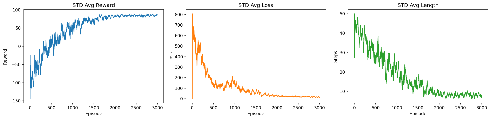
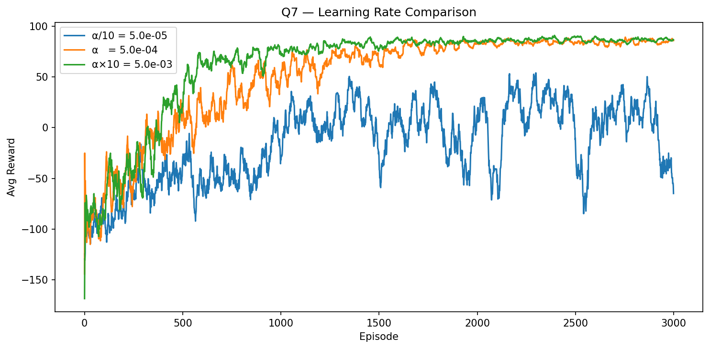
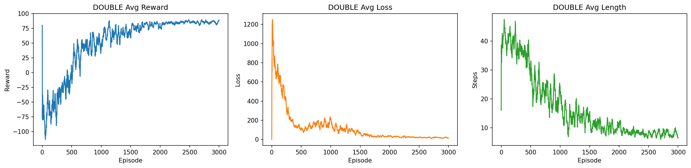
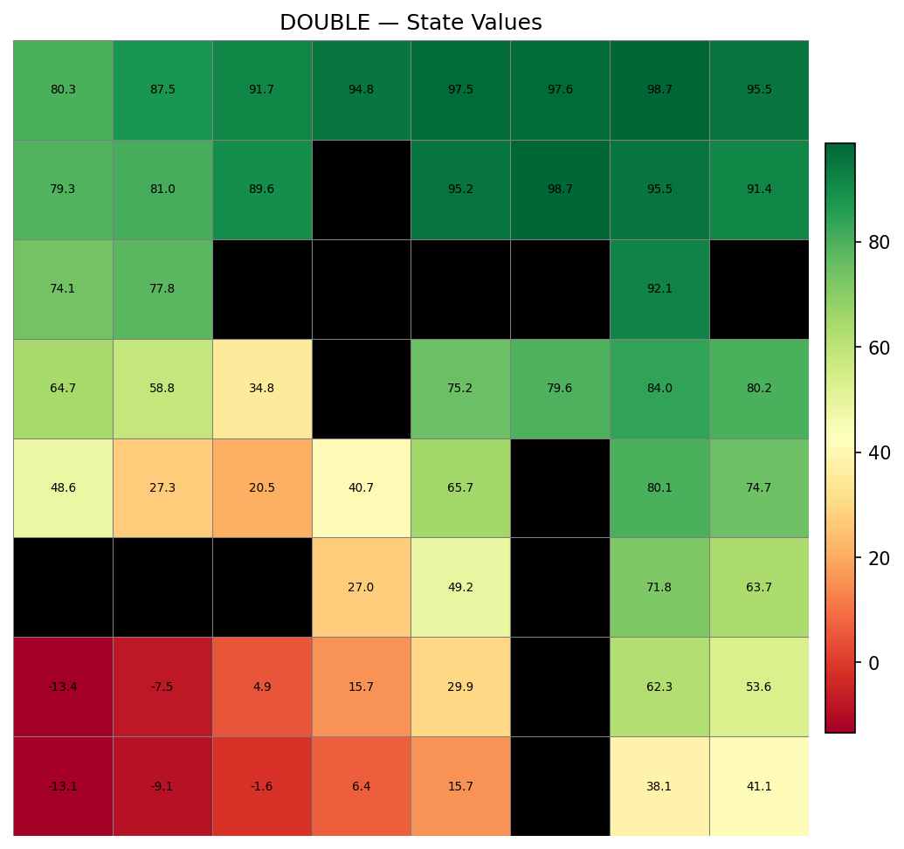
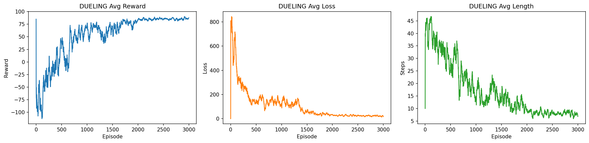
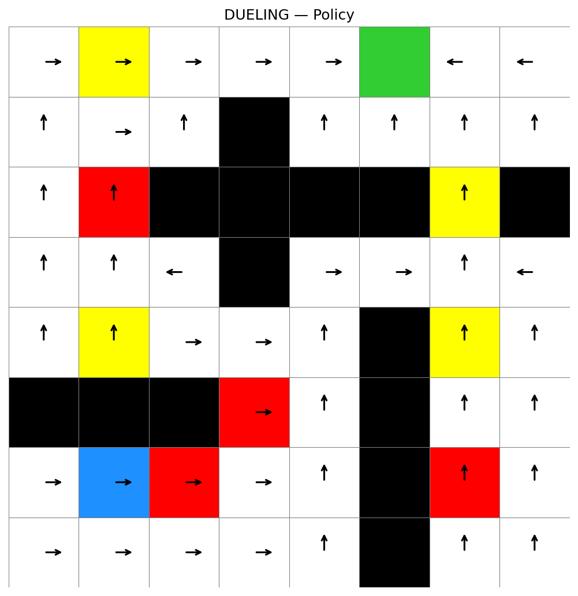
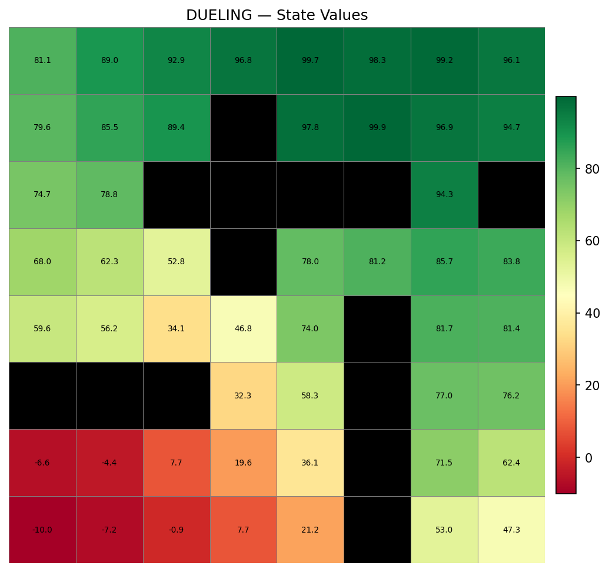
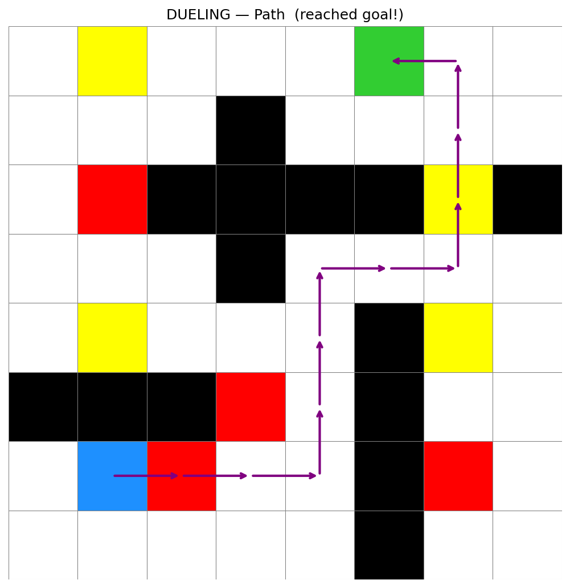
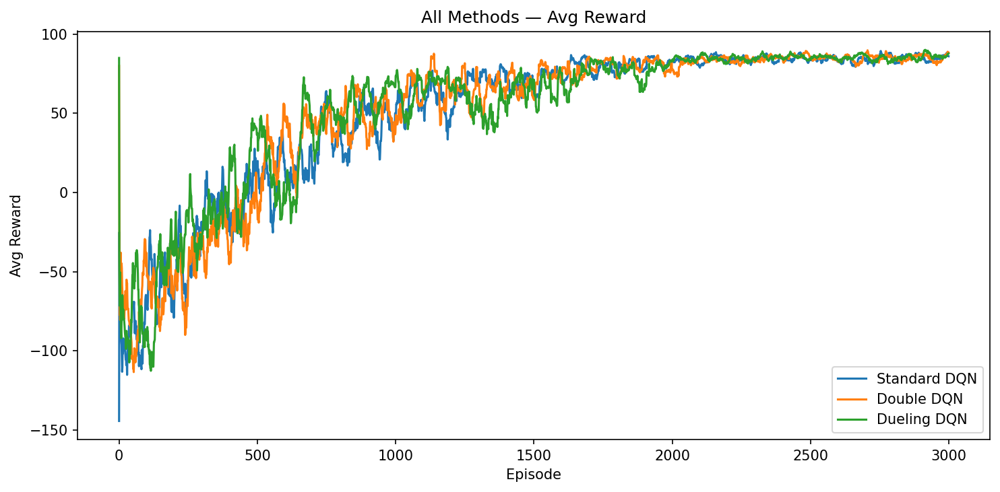
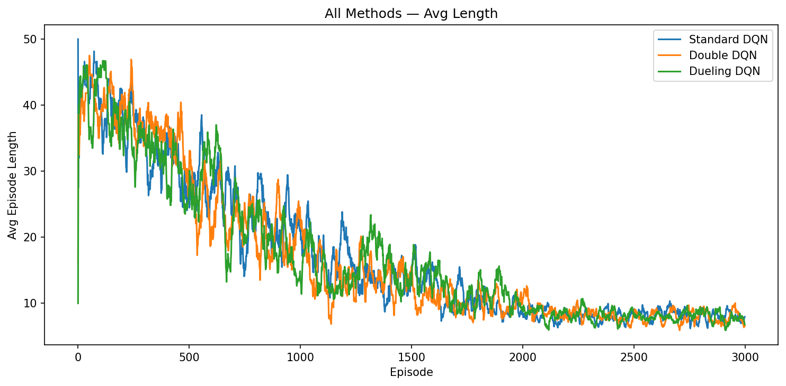

# EECE 5614 — Project 4: DQN Variants on Stochastic Maze

> **Course:** EECE 5614 Reinforcement Learning and Decision Making Under Uncertainty, Northeastern University, Spring 2026
> **Author:** Shoukang Yu

---

## What This Project Does

This project trains a reinforcement learning agent to navigate an **8×8 stochastic maze** from a random start position to a fixed goal using three Deep Q-Network variants:

| Algorithm | Key Idea |
|-----------|----------|
| **Standard DQN** | Target network evaluates both action selection and Q-value |
| **Double DQN** | Online network selects action; target network evaluates it — reduces overestimation bias |
| **Dueling DQN** | Splits Q-value into state value V(s) and advantage A(s,a) — faster convergence |

---

## Maze Layout

```
x:  0    1    2    3    4    5    6    7
y=0:[   ][Yel][   ][   ][   ][Grn][   ][   ]   ← Goal (5,0)  +100
y=1:[   ][   ][   ][###][   ][   ][   ][   ]
y=2:[   ][Red][###][###][###][###][Yel][###]
y=3:[   ][   ][   ][###][   ][   ][   ][   ]
y=4:[   ][Yel][   ][   ][   ][###][Yel][   ]
y=5:[###][###][###][Red][   ][###][   ][   ]
y=6:[   ][Blu][Red][   ][   ][###][Red][   ]   ← Start (1,6)
y=7:[   ][   ][   ][   ][   ][###][   ][   ]
```

`###`=wall · `Grn`=goal · `Blu`=start · `Yel`=−5 penalty · `Red`=−10 penalty

**Reward structure:**

| Event | Reward |
|-------|--------|
| Every step | −1 |
| Hit wall (stay) | −1.8 total |
| Land on yellow cell | −6 total |
| Land on red cell | −11 total |
| Reach goal | +99 total |

**Transition noise:** `P = 0.025` — with probability 0.975 the agent moves as intended; with probability 0.0125 each it slips to either perpendicular direction.

---

## Results

### Standard DQN — Training Curves


### Standard DQN — Learned Policy


### Standard DQN — State Values


### Standard DQN — Path from Start to Goal


---

### Q7: Effect of Learning Rate


The baseline α = 5×10⁻⁴ gives the best balance of convergence speed and stability. A 10× larger rate converges faster initially but becomes unstable after episode 2000; a 10× smaller rate has not converged after 3000 episodes.

---

### Double DQN — Training Curves


### Double DQN — Learned Policy


### Double DQN — State Values


### Double DQN — Path from Start to Goal


---

### Dueling DQN — Training Curves


### Dueling DQN — Learned Policy


### Dueling DQN — State Values


### Dueling DQN — Path from Start to Goal


---

### Three-Way Comparison

| | Avg Reward |
|-|------------|
|  | |



**Key findings:**
- All three methods successfully solve the maze and converge to similar final performance (~85–90 avg reward)
- **Dueling DQN** converges fastest (reaches 50 avg reward by episode ~400)
- **Double DQN** produces the most accurate (least overestimated) Q-values
- **Standard DQN** is the simplest baseline

---

## Network Architectures

### DQN / Double DQN
```
Input(2) → Linear(128) → ReLU
         → Linear(128) → ReLU
         → Linear(128) → ReLU
         → Linear(4)        ← Q-values for UP / RIGHT / DOWN / LEFT
```

### Dueling DQN
```
Input(2) → Linear(128) → ReLU → Linear(128) → ReLU    [shared feature trunk]
                ├── Linear(128) → ReLU → Linear(1)     [Value stream  V(s)]
                └── Linear(128) → ReLU → Linear(4)     [Advantage stream A(s,a)]
                Q(s,a) = V(s) + A(s,a) − mean_a'[A(s,a')]
```

---

## Hyperparameters

| Parameter | Value |
|-----------|-------|
| Episodes | 3000 |
| Max steps / episode | 50 |
| Replay buffer | 10,000 |
| Minibatch size | 64 |
| Discount γ | 0.98 |
| Learning rate α | 5×10⁻⁴ |
| Q-net update interval | every 4 steps |
| Soft update rate η | 1×10⁻³ |
| ε schedule | max(0.1, 0.999^episode) |

---

## File Structure

```
├── maze.py        # Maze environment: step(), reset(), reward, walls
├── dqn.py         # Neural networks: DQN, DuelingDQN
├── agent.py       # ReplayBuffer + DQNAgent (standard / double / dueling)
├── train.py       # Training loop + epsilon schedule
├── visualize.py   # Plotting: policy arrows, value heatmap, path, curves
├── main.py        # Runs all experiments, saves all figures
└── result/        # All output figures (15 PNG files)
```

## How to Run

```bash
pip install torch numpy matplotlib
python main.py
```